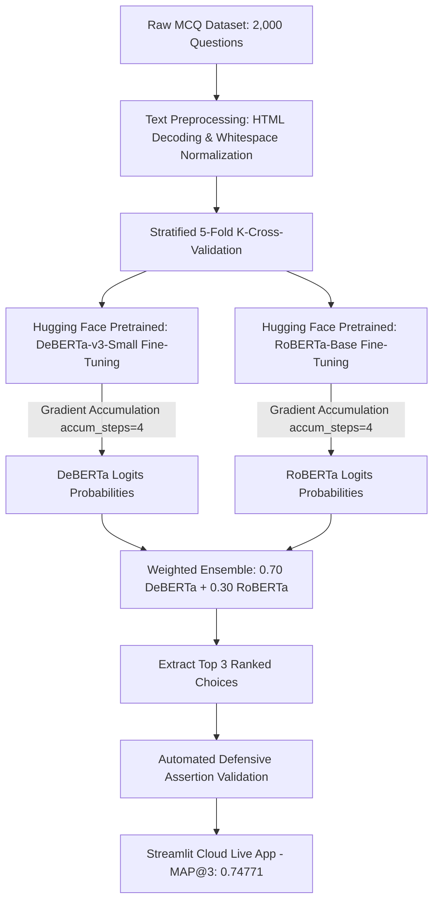

# 🧠 Smart MCQ Solver: NLP Multiple-Choice Ranking System

[](https://www.python.org/)
[](https://pytorch.org/)
[](https://dl-genai-mcq-solver-22f2000003.streamlit.app/)
[](https://huggingface.co/models)
[](https://wandb.ai/)
[](#-performance--benchmark-results)
[](LICENSE)

An end-to-end Machine Learning and Natural Language Processing (NLP) pipeline designed to solve and rank multiple-choice science questions evaluated under **Mean Average Precision at 3 (MAP@3)**.

> 🚀 **Live Interactive Web App Deployment:**  
> 👉 [**Smart MCQ Solver**](https://dl-genai-mcq-solver-22f2000003.streamlit.app/)

The project leverages pre-trained transformer backbones from Hugging Face (`microsoft/deberta-v3-small` and `roberta-base`), fine-tuned in PyTorch using **5-Fold Stratified Cross-Validation**, **Gradient Accumulation**, and **Weighted Ensembling**, achieving a peak score of **0.74771**.

---

## 📌 Table of Contents
- [Executive Summary](#-executive-summary)
- [System Architecture](#-system-architecture)
- [Performance & Benchmark Results](#-performance--benchmark-results)
- [Key Features & Engineering Highlights](#-key-features--engineering-highlights)
- [Repository Structure](#-repository-structure)
- [Installation & Setup](#-installation--setup)
- [Pipeline Execution](#-pipeline-execution)
- [Live Deployment & Web App](#-live-deployment--web-app)
- [Evaluation Metric (MAP@3)](#-evaluation-metric-map3)
- [Author & Acknowledgments](#-author--acknowledgments)

---

## 📝 Executive Summary

Given a question prompt and 5 candidate options (labeled A, B, C, D, and E), the goal of the **Smart MCQ Solver** is to predict the top 3 most likely correct choices in ranked order. 

### Key Achievements:
- **Baseline:** Implemented a TF-IDF keyword overlap baseline (**MAP@3: 0.32658**).
- **Custom Deep Learning:** Built a custom PyTorch `ScratchBiLSTM` with global max pooling. Diagnosed cross-validation vs leaderboard distribution shift (**CV: 0.99267** vs **LB: ~0.335**).
- **Transformer Fine-Tuning:** Leveraged Hugging Face pre-trained backbones, fine-tuning `microsoft/deberta-v3-small` (**LB: 0.732**) and `roberta-base` (**LB: 0.718**) across 5 folds.
- **Ensembling:** Designed a weighted probability ensemble (70% DeBERTa + 30% RoBERTa) achieving the final peak score of **0.74771**, comfortably beating the target benchmark of **0.730**.
- **Deployment:** Deployed an end-to-end interactive web application via **Streamlit Cloud** and logged training runs via **Weights & Biases**.

---

## 🏗️ System Architecture



---

## 📊 Performance & Benchmark Results

| Model | Pre-trained Source | Local 5-Fold CV MAP@3 | Leaderboard MAP@3 Score | Main Advantage | Main Disadvantage |
| :--- | :---: | :---: | :---: | :--- | :--- |
| **TF-IDF Baseline** | N/A | N/A | **0.32658** | Extremely fast, zero training time | Cannot capture word semantics or context |
| **Custom BiLSTM** | Scratch (PyTorch) | 0.99267 | **~0.33500** | Lightweight, low memory footprint | Overfits heavily on small training corpus |
| **RoBERTa-Base** | Hugging Face | 0.97650 | **0.71800** | Robust positional context understanding | Higher VRAM requirement |
| **DeBERTa-v3-Small** | Hugging Face | 0.97608 | **0.73200** | Best single model (Disentangled Attention)| Tokenization memory intensive |
| **Weighted Ensemble (Final)** | Hybrid | Out-of-Fold | **0.74771** 🏆 | **Highest accuracy & stability** | Requires running two transformer passes |

---

## 🚀 Key Features & Engineering Highlights

- **Pre-trained Transformer Integration:** Utilized Hugging Face's `AutoTokenizer` and `AutoModelForMultipleChoice` APIs for loading state-of-the-art pre-trained Transformer weights (`deberta-v3-small` and `roberta-base`).
- **Text Preprocessing Pipeline:** Sanitized HTML entities (`html.unescape`), normalized smart quotation marks, and stripped redundant whitespace using regex (`re.sub(r"\s+", " ", text)`).
- **Disentangled Attention:** Leveraged DeBERTa-v3's disentangled attention mechanism, separating content embeddings from relative positional embeddings for contextual sentence understanding.
- **Gradient Accumulation:** Resolved CUDA Out-Of-Memory (OOM) GPU constraints by accumulating gradients across `accum_steps = 4` sub-batches to simulate effective batch sizes of 16.
- **Defensive Assertion Checks:** Post-inference pipeline verifies row count integrity (500 rows), schema validation (`['ID', 'Prediction']`), zero null values, and exact 3-pick space-separated output formatting.

---

## 📁 Repository Structure

```
.
├── 📄 README.md                        # Master Project Documentation
├── 📄 project_report_updated.md        # Detailed Academic/Project Report
├── 📁 smart-mcq-solver-challenge/
│   ├── 📄 train.csv                    # Training dataset (2,000 MCQs)
│   ├── 📄 test.csv                     # Test dataset (500 MCQs)
│   └── 📄 sample_submission.csv        # Required submission format
└── 📁 src/                             # Source code (Models & Pipeline)
    ├── 📄 preprocess.py                # Text cleaning & Dataset class
    ├── 📄 train_bilstm.py              # Custom BiLSTM PyTorch implementation
    ├── 📄 train_transformer.py         # DeBERTa & RoBERTa fine-tuning scripts
    ├── 📄 ensemble.py                  # 70/30 Weighted ensembling script
    └── 📄 evaluate.py                  # MAP@3 evaluation & post-inference assertions
```

---

## 🛠️ Installation & Setup

### 1. Clone the Repository
```bash
git clone https://github.com/zarrinnehal/smart-mcq-solver.git
cd smart-mcq-solver
```

### 2. Create Virtual Environment
```bash
python -m venv venv
# On Windows
venv\Scripts\activate
# On Linux/macOS
source venv/bin/activate
```

### 3. Install Dependencies
```bash
pip install -r requirements.txt
```

---

## ⚡ Pipeline Execution

### Step 1: Preprocess & Train Baseline TF-IDF Model
```bash
python src/preprocess.py
python src/evaluate.py --model tfidf
```

### Step 2: Fine-Tune DeBERTa-v3 & RoBERTa 5-Fold Checkpoints
```bash
python src/train_transformer.py --model_name microsoft/deberta-v3-small --folds 5 --accum_steps 4
python src/train_transformer.py --model_name roberta-base --folds 5 --accum_steps 4
```

### Step 3: Run Weighted Ensembling & Assertions Validation
```bash
python src/ensemble.py --weight_deberta 0.70 --weight_roberta 0.30
```

---

## 🌐 Live Deployment & Web App

The end-to-end multiple-choice solver is deployed as a live web application using **Streamlit Cloud**:

- 🔗 **Live Web Application:** [**Smart MCQ Solver App**](https://dl-genai-mcq-solver-22f2000003.streamlit.app/)
- 📊 **Experiment Tracking:** Logged via **Weights & Biases (W&B)** (`22f2000003-t22026`).

---

## 📐 Evaluation Metric (MAP@3)

Mean Average Precision at 3 is calculated as:

$$\text{MAP@3} = \frac{1}{N} \sum_{i=1}^{N} \sum_{k=1}^{\min(3, P_i)} P(k) \times \text{rel}(k)$$

For single-answer multiple-choice questions:
- **1st guess correct:** $1.0$ point
- **2nd guess correct:** $0.5$ points
- **3rd guess correct:** $0.333$ points
- **Not in top 3:** $0.0$ points

---

## 👤 Author

- **Author:** Zarrin Nehal

---

## 📜 License
This project is open-source and available under the [MIT License](LICENSE).
